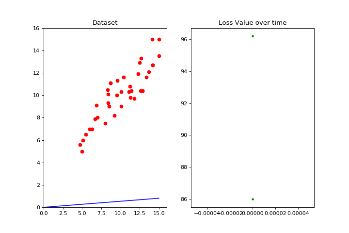

# Data Science in Python

Collection of data science concepts written in Python.

## Setup

1. Install the Python packages

   ```bash
   $ pip install -r requirements.txt
   ```

1. Run the script

   ```bash
   $ python gradient_descent.py
   ```

## Gradient Descent


